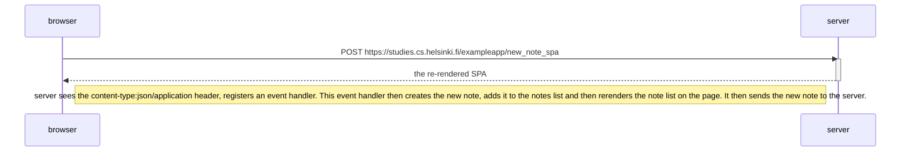

```mermaid
sequenceDiagram
    participant browser
    participant server

    browser->>server: POST https://studies.cs.helsinki.fi/exampleapp/new_note_spa
    activate server
    server-->>browser: the re-rendered SPA
    deactivate server

    Note right of browser: server sees the content-type:json/application header, registers an event handler.  This  event handler then creates the new note, adds it to the notes list and then rerenders the note list on the page.  It then sends the new note to the server.
```